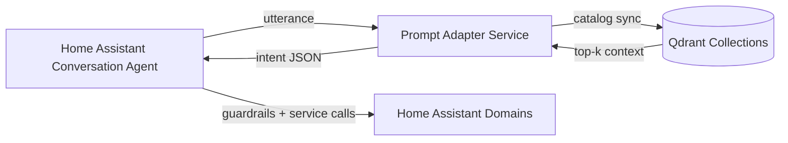

# EntangledHome - Assistant

EntangledHome bridges Home Assistant, a prompt-adapter FastAPI microservice, and a Qdrant
vector store to turn natural language requests into guarded service calls.

> Status: integration scaffold. Wire your adapter service and Qdrant collections to unlock
> full functionality.

## Architecture Overview



1. Home Assistant captures a free-form utterance and forwards it to the adapter service.
2. The adapter enriches the prompt with catalog slices retrieved from Qdrant, validates the
   model output against the intent schema, and emits structured JSON.
3. Home Assistant checks guardrails (secondary signals, confidence thresholds) before routing
   the action to the relevant domain service call.

## Setup

### Home Assistant Configuration

1. Copy the repository (HACS custom repository or manual) into `custom_components/`.
2. Add the integration either through the UI or YAML. The YAML example below is also published
   at [`docs/examples/homeassistant_configuration.yaml`](docs/examples/homeassistant_configuration.yaml).

```yaml
# configuration.yaml
entangledhome:
  adapter_url: "http://adapter:8080/interpret"
  qdrant:
    host: "qdrant"
    port: 6333
    api_key: !secret qdrant_api_key
  guardrails:
    confidence_threshold: 0.65
    secondary_signals:
      presence:
        enabled: true
        entities:
          - person.alice
          - person.bob
      voice:
        enabled: true
        ttl_seconds: 45
```

3. Restart Home Assistant and confirm the integration loads without warnings.
4. (Optional) Enable the catalog coordinator to push entity updates to Qdrant via the
   integration options flow.

### Adapter Service Deployment

1. Provision environment variables documented in
   [`adapter_service/README.md`](adapter_service/README.md) so the FastAPI service knows how to
   reach Qdrant and downstream model APIs.
2. Deploy the adapter service close to Home Assistant (LAN or the same docker network) and
   expose `POST /interpret`.
3. Ensure the service validates all outputs against the published JSON schema before replying
   to Home Assistant.
4. Configure TLS or reverse-proxy authentication when the adapter runs off-box.

### Qdrant Requirements

- Provision two collections: `ha_entities` (Home Assistant areas/devices/scenes) and
  `plex_media` (media catalog).
- Each collection should be created with a cosine metric, vector size matching your embedding
  model (e.g., 384 for `text-embedding-3-small` equivalents), and payload schemas described in
  [`adapter_service/README.md`](adapter_service/README.md).
- Configure Qdrant API keys and network policies so only Home Assistant and the adapter can
  access the collections.
- Seed initial payloads by exporting Home Assistant registries and Plex metadata before
  enabling live sync jobs.

## Guardrails and Security

Sensitive intents (unlocking doors, opening garages, disarming alarm panels) use the adapter’s
`required_secondary_signals` contract. The integration provides two built-in signals:

- `presence` &ndash; satisfied when configured `person.*` entities report `home`. The provider also
  emits entity-scoped tokens such as `presence:person.alice` for fine-grained policies.
- `voice` &ndash; satisfied when a recent voice profile match is stored. The helper writes tokens such
  as `voice:alice` with a configurable TTL.

Additional safeguards:

- Confidence gating: set via options to require a minimum adapter confidence score.
- Intent allow/block lists: restricts which service domains the adapter may invoke.
- Signature checks: if enabled, Home Assistant signs requests to the adapter and validates the
  response signature documented in the adapter README.
- Sensitive intent double-confirmation: downstream automations can prompt users for follow-up
  confirmations before executing irreversible actions.

## Testing

1. Install development dependencies with `scripts/setup_env.sh` and `source .venv/bin/activate`.
2. Run static analysis:
   ```bash
   ruff check
   ```
3. Execute the full pytest suite (includes documentation guardrails):
   ```bash
   pytest
   ```
4. For adapter service changes, run the FastAPI app locally and exercise `POST /interpret`
   using the catalog fixtures stored in `tests/stubs/`.

Continuous integration fails when documentation sections or example assets drift from the
requirements enforced in `tests/test_documentation.py`, ensuring README guidance stays accurate.

## Secondary Signals Reference

Secondary signals are controlled via config entry options (UI or YAML overrides):

| Option key | Description |
|------------|-------------|
| `secondary_signals_presence_enabled` | Enable checks against `person.*` entities. |
| `secondary_signals_presence_entities` | List of entity IDs that prove presence. |
| `secondary_signals_voice_enabled` | Enable recent-voice detection guardrail. |
| `secondary_signals_voice_ttl_seconds` | Validity window for voice matches (default 30s). |

Voice profiles can be recorded by calling
`record_voice_identifier(hass, entry_id, voice_id)` from
`custom_components.entangledhome.secondary_signals`. Integrations that process STT events can store
voice hits there so the guardrail becomes satisfied for the next few seconds.
