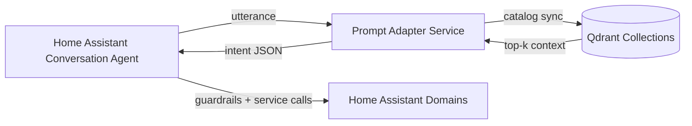

# EntangledHome - Assistant

EntangledHome bridges Home Assistant, a prompt-adapter FastAPI microservice, and a Qdrant
vector store to turn natural language requests into guarded service calls.

> Status: integration scaffold. Wire your adapter service and Qdrant collections to unlock
> full functionality.

## Architecture Overview



1. Home Assistant captures a free-form utterance and forwards it to the adapter service.
2. The adapter enriches the prompt with catalog slices retrieved from Qdrant, validates the
   model output against the intent schema, and emits structured JSON.
3. Home Assistant checks guardrails (secondary signals, confidence thresholds) before routing
   the action to the relevant domain service call.

## Setup

### Home Assistant Configuration

1. Copy the repository (HACS custom repository or manual) into `custom_components/`.
2. Add the integration either through the UI or YAML. The YAML example below is also published
   at [`docs/examples/homeassistant_configuration.yaml`](docs/examples/homeassistant_configuration.yaml).

```yaml
# configuration.yaml
entangledhome:
  adapter_url: "http://adapter:8080/interpret"
  qdrant:
    host: "qdrant"
    port: 6333
    api_key: !secret qdrant_api_key
  guardrails:
    confidence_threshold: 0.65
    secondary_signals:
      presence:
        enabled: true
        entities:
          - person.alice
          - person.bob
      voice:
        enabled: true
        ttl_seconds: 45
```

3. Restart Home Assistant and confirm the integration loads without warnings.
4. (Optional) Enable the catalog coordinator to push entity updates to Qdrant via the
   integration options flow.

### Qdrant Requirements

- Provision two collections: `ha_entities` (Home Assistant areas/devices/scenes) and
  `plex_media` (media catalog).
- Each collection should be created with a cosine metric, vector size matching your embedding
  model (e.g., 384 for `text-embedding-3-small` equivalents), and payload schemas described in
  [`adapter_service/README.md`](adapter_service/README.md).
- Configure Qdrant API keys and network policies so only Home Assistant and the adapter can
  access the collections.
- Seed initial payloads by exporting Home Assistant registries and Plex metadata before
  enabling live sync jobs.

## Configurable intents

Fine-tune the adapter handshake per intent by editing the `intents_config` mapping. This mapping
controls slot hints, guardrail behavior, and downstream service overrides the adapter should
respect when generating structured intents.

### YAML configuration example

A standalone YAML example is available at
[`docs/examples/intents.yaml`](docs/examples/intents.yaml). Include it from `configuration.yaml`
or merge it into the existing `entangledhome` block:

```yaml
entangledhome:
  intents_config:
    entangledhome.turn_on:
      slot_hints:
        color:
          - warm
          - daylight
      confidence_threshold: 0.75
    entangledhome.open_garage:
      dangerous: true
      allowed_hours:
        start: 6
        end: 21
      required_secondary_signals:
        - presence:person.alice
```

### UI configuration walkthrough

1. Navigate to **Settings → Devices & Services → Integrations → EntangledHome - Assistant**.
2. Choose **Configure** to open the options flow and scroll to **Intent routing configuration**.
3. Paste a JSON object mirroring the YAML example above, including keys such as
   `dangerous`, `confidence_threshold`, `allowed_hours`, and `required_secondary_signals`.
4. Adjust the companion fields exposed in the UI (`Dangerous intents`, `Intent thresholds`,
   `Allowed hours`, and `Recent command window overrides`) to keep guardrail metadata synchronized
   with the adapter hints.
5. Submit the form and reload the integration. The adapter receives the updated mapping on the
   next utterance.

## Guardrails and Security

Sensitive intents (unlocking doors, opening garages, disarming alarm panels) use the adapter’s
`required_secondary_signals` contract. The integration provides two built-in signals:

- `presence` &ndash; satisfied when configured `person.*` entities report `home`. The provider also
  emits entity-scoped tokens such as `presence:person.alice` for fine-grained policies.
- `voice` &ndash; satisfied when a recent voice profile match is stored. The helper writes tokens such
  as `voice:alice` with a configurable TTL.

Additional safeguards:

- Confidence gating: set via options to require a minimum adapter confidence score.
- Intent allow/block lists: restricts which service domains the adapter may invoke.
- Signature checks: if enabled, Home Assistant signs requests to the adapter and validates the
  response signature documented in the adapter README.
- Sensitive intent double-confirmation: downstream automations can prompt users for follow-up
  confirmations before executing irreversible actions.

## Guardrail thresholds and dangerous intents

Guardrail metadata can be edited globally or per intent:

- **Confidence threshold** &ndash; set the global gate in the options flow or override individual
  intents via `intents_config.<intent>.confidence_threshold`.
- **Dangerous intents** &ndash; list intent IDs in the **Dangerous intents** field or mark
  `dangerous: true` inside the intents mapping. Dangerous intents require secondary signals and
  can be constrained to allowed hours.
- **Allowed hours** &ndash; configure daily windows that suppress execution outside business hours.
- **Recent command window overrides** &ndash; widen or shrink the deduplication window for intents
  that should never double-fire.

When a dangerous intent executes, the integration annotates telemetry payloads with
`dangerous: true` so downstream automations can log or audit critical invocations.

## Testing

1. Install development dependencies with `scripts/setup_env.sh` and `source .venv/bin/activate`.
2. Run static analysis:
   ```bash
   ruff check
   ```
3. Execute the full pytest suite (includes documentation guardrails):
   ```bash
   pytest
   ```
4. For adapter service changes, run the FastAPI app locally and exercise `POST /interpret`
   using the catalog fixtures stored in `tests/stubs/`.

Continuous integration fails when documentation sections or example assets drift from the
requirements enforced in `tests/test_documentation.py`, ensuring README guidance stays accurate.

## Conversation Sentences

The integration ships conversation sentence templates for each supported intent and a fallback
catch-all intent. Home Assistant loads the packaged defaults from
`custom_components/entangledhome/sentences/en/`. To provide sentence overrides, drop a file with the
same intent name under your Home Assistant configuration at
`config/custom_components/entangledhome/sentences/en/<intent>.yaml`. On setup the integration
prefers these sentence overrides while continuing to expose the packaged defaults for intents that
do not have a local template. The catch-all intent remains active regardless of overrides so free
form commands continue to flow to the adapter service.

## Sentence customization

Review [`docs/examples/sentences.en.yaml`](docs/examples/sentences.en.yaml) for a sample
catch-all override with localized slot hints. The integration reloads sentence overrides whenever
the config entry restarts, so edits take effect after a single reload. Pair these overrides with
the intents configuration to steer the adapter toward the vocabulary your household uses.

## Secondary Signals Reference

Secondary signals are controlled via config entry options (UI or YAML overrides):

| Option key | Description |
|------------|-------------|
| `secondary_signals_presence_enabled` | Enable checks against `person.*` entities. |
| `secondary_signals_presence_entities` | List of entity IDs that prove presence. |
| `secondary_signals_voice_enabled` | Enable recent-voice detection guardrail. |
| `secondary_signals_voice_ttl_seconds` | Validity window for voice matches (default 30s). |

Voice profiles can be recorded by calling
`record_voice_identifier(hass, entry_id, voice_id)` from
`custom_components.entangledhome.secondary_signals`. Integrations that process STT events can store
voice hits there so the guardrail becomes satisfied for the next few seconds.

## Qdrant ingestion scripts

The `scripts/` package contains helpers for bootstrapping Qdrant collections:

- `scripts/ingest_entities.py` &ndash; Exports Home Assistant area/device/scene metadata using the
  websocket API and upserts the payloads into the `ha_entities` collection.
- `scripts/ingest_plex.py` &ndash; Walks the Plex API and stores movies, shows, and music entries in
  `plex_media`.
- `scripts/_qdrant.py` &ndash; Shared utilities for creating collections with the expected schema.

Run these scripts from a virtual environment (`uv run python scripts/ingest_entities.py`) or bake
them into scheduled automations so the adapter receives fresh context.

## Adapter deployment

### Adapter Service Deployment

1. Provision environment variables documented in
   [`adapter_service/README.md`](adapter_service/README.md) so the FastAPI service knows how to
   reach Qdrant and downstream model APIs.
2. Deploy the adapter service close to Home Assistant (LAN or the same docker network) and
   expose `POST /interpret`.
3. Ensure the service validates all outputs against the published JSON schema before replying
   to Home Assistant.
4. Configure TLS or reverse-proxy authentication when the adapter runs off-box.

### Rolling out updates

- Containerized deployments: build and push a new adapter image, then restart the stack.
- Bare-metal installs: pull the repository, run `uv sync`, and restart the FastAPI app.
- During upgrades, monitor the adapter logs for JSON schema validation warnings &ndash; these signal
  prompt drift that requires regeneration or fine-tuning.

## Migration notes

See [`docs/migration.md`](docs/migration.md) for a running log of schema changes, deprecated
options, and upgrade strategies. Each release entry describes:

- Components that changed and any required Home Assistant configuration updates.
- Guardrail defaults that moved or were renamed.
- Qdrant payload adjustments that require backfilling vector metadata.

## Troubleshooting

If the integration fails to load or the adapter returns errors, start with
[`docs/troubleshooting.md`](docs/troubleshooting.md). The guide covers:

- Common issues such as missing credentials or stale catalog caches.
- Adapter connectivity debugging with `uv run scripts/ingest_entities.py --dry-run` and
  HTTP tracing.
- Qdrant ingestion problems, including schema mismatch and rejected payloads.
